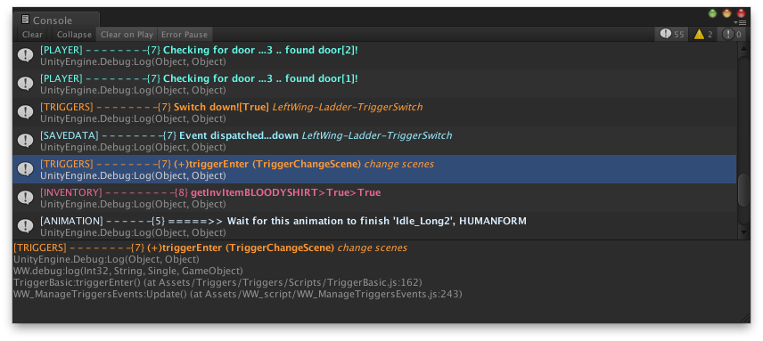

      This is a proof of concept rather than a full scale solution
		
		Showing how to color text & how to wrap it so it jumps to line of code being debugged.

		1. To color text wrap it in <color></color> tags
		2. To enable double-click on console to jump ot proper line of code - code needs to be compiled 
			into a DLL. Follow simple instructions from Unity's web site.
 
		To use (after you compile DLL and put it in your Plugins folder):

		debug.log("Important message. Color it red and show in the console");

		debug.log(debug.cat.YOURCATEGORY, "Debug message from a specific category. Custom color and important level (will always print)");

		debug.log(debug.cat.YOURCATEGORY, "Debug message from a specific category, moderate importantce (marked as debug level 5)", 5);

		debug.log(debug.cat.YOURCATEGORY, "Debug message, same as previous but will also print gameObject containing this call, it's name as well as highlight it from console+click)", 1, gameObject);

You can now sort through debug output.

Sort by importance level (you set level within debug call itself, for each message).

Check/uncheck categories.

And you can mark an object sa 'important' (just drag&drop), which will mark all debug messages in the same hierarchy as 'important'. Meaning, gameObject be marked as important: show up as red&bolded text.
To clear important object field click the small red tick box.